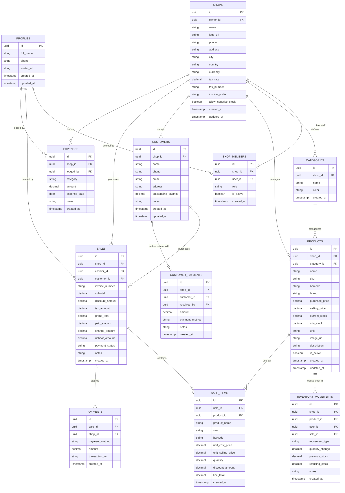

# PocketPOS — Database Architecture & Schema Specification

## 1. Entity-Relationship Diagram (ERD)



---

## 2. Table Specifications & Constraints

### 2.1 Table: `profiles`
Extends Supabase `auth.users` with user metadata.
```sql
CREATE TABLE public.profiles (
    id UUID PRIMARY KEY REFERENCES auth.users(id) ON DELETE CASCADE,
    full_name TEXT NOT NULL,
    phone TEXT,
    avatar_url TEXT,
    created_at TIMESTAMPTZ NOT NULL DEFAULT NOW(),
    updated_at TIMESTAMPTZ NOT NULL DEFAULT NOW()
);
```

### 2.2 Table: `shops`
Core multi-tenant container entity.
```sql
CREATE TABLE public.shops (
    id UUID PRIMARY KEY DEFAULT gen_random_uuid(),
    owner_id UUID NOT NULL REFERENCES public.profiles(id) ON DELETE RESTRICT,
    name TEXT NOT NULL,
    logo_url TEXT,
    phone TEXT NOT NULL,
    address TEXT,
    city TEXT NOT NULL DEFAULT 'Karachi',
    country TEXT NOT NULL DEFAULT 'Pakistan',
    currency VARCHAR(10) NOT NULL DEFAULT 'PKR',
    tax_rate NUMERIC(5,2) NOT NULL DEFAULT 0.00 CHECK (tax_rate >= 0),
    tax_number TEXT,
    invoice_prefix VARCHAR(10) NOT NULL DEFAULT 'INV-',
    allow_negative_stock BOOLEAN NOT NULL DEFAULT FALSE,
    created_at TIMESTAMPTZ NOT NULL DEFAULT NOW(),
    updated_at TIMESTAMPTZ NOT NULL DEFAULT NOW()
);

CREATE INDEX idx_shops_owner ON public.shops(owner_id);
```

### 2.3 Table: `shop_members`
Defines membership and role-based permissions (`OWNER`, `CASHIER`).
```sql
CREATE TYPE user_role AS ENUM ('OWNER', 'CASHIER');

CREATE TABLE public.shop_members (
    id UUID PRIMARY KEY DEFAULT gen_random_uuid(),
    shop_id UUID NOT NULL REFERENCES public.shops(id) ON DELETE CASCADE,
    user_id UUID NOT NULL REFERENCES public.profiles(id) ON DELETE CASCADE,
    role user_role NOT NULL DEFAULT 'CASHIER',
    is_active BOOLEAN NOT NULL DEFAULT TRUE,
    created_at TIMESTAMPTZ NOT NULL DEFAULT NOW(),
    UNIQUE(shop_id, user_id)
);

CREATE INDEX idx_shop_members_lookup ON public.shop_members(user_id, shop_id, role);
```

### 2.4 Table: `categories`
Product grouping.
```sql
CREATE TABLE public.categories (
    id UUID PRIMARY KEY DEFAULT gen_random_uuid(),
    shop_id UUID NOT NULL REFERENCES public.shops(id) ON DELETE CASCADE,
    name TEXT NOT NULL,
    color VARCHAR(20) DEFAULT '#2563EB',
    created_at TIMESTAMPTZ NOT NULL DEFAULT NOW(),
    UNIQUE(shop_id, name)
);

CREATE INDEX idx_categories_shop ON public.categories(shop_id);
```

### 2.5 Table: `products`
Product inventory catalog.
```sql
CREATE TABLE public.products (
    id UUID PRIMARY KEY DEFAULT gen_random_uuid(),
    shop_id UUID NOT NULL REFERENCES public.shops(id) ON DELETE CASCADE,
    category_id UUID REFERENCES public.categories(id) ON DELETE SET NULL,
    name TEXT NOT NULL,
    sku TEXT,
    barcode TEXT,
    brand TEXT,
    purchase_price NUMERIC(12,2) NOT NULL DEFAULT 0.00 CHECK (purchase_price >= 0),
    selling_price NUMERIC(12,2) NOT NULL CHECK (selling_price >= 0),
    current_stock NUMERIC(12,3) NOT NULL DEFAULT 0.000,
    min_stock NUMERIC(12,3) NOT NULL DEFAULT 5.000 CHECK (min_stock >= 0),
    unit VARCHAR(20) NOT NULL DEFAULT 'pcs',
    image_url TEXT,
    description TEXT,
    is_active BOOLEAN NOT NULL DEFAULT TRUE,
    created_at TIMESTAMPTZ NOT NULL DEFAULT NOW(),
    updated_at TIMESTAMPTZ NOT NULL DEFAULT NOW(),
    CONSTRAINT uq_shop_barcode UNIQUE NULLS NOT DISTINCT (shop_id, barcode)
);

CREATE INDEX idx_products_shop_barcode ON public.products(shop_id, barcode);
CREATE INDEX idx_products_shop_search ON public.products(shop_id, name text_pattern_ops);
```

### 2.6 Table: `inventory_movements`
Audit log of every stock adjustment.
```sql
CREATE TYPE stock_movement_type AS ENUM (
    'SALE', 
    'PURCHASE_RECEIPT', 
    'MANUAL_CORRECTION', 
    'RETURN', 
    'DAMAGED_EXPIRED'
);

CREATE TABLE public.inventory_movements (
    id UUID PRIMARY KEY DEFAULT gen_random_uuid(),
    shop_id UUID NOT NULL REFERENCES public.shops(id) ON DELETE CASCADE,
    product_id UUID NOT NULL REFERENCES public.products(id) ON DELETE CASCADE,
    user_id UUID REFERENCES public.profiles(id) ON DELETE SET NULL,
    sale_id UUID, -- Foreign key to sales, added via alter table
    movement_type stock_movement_type NOT NULL,
    quantity_change NUMERIC(12,3) NOT NULL,
    previous_stock NUMERIC(12,3) NOT NULL,
    resulting_stock NUMERIC(12,3) NOT NULL,
    notes TEXT,
    created_at TIMESTAMPTZ NOT NULL DEFAULT NOW()
);

CREATE INDEX idx_movements_shop_product ON public.inventory_movements(shop_id, product_id, created_at DESC);
```

### 2.7 Table: `customers`
Customer directory and credit balance tracker.
```sql
CREATE TABLE public.customers (
    id UUID PRIMARY KEY DEFAULT gen_random_uuid(),
    shop_id UUID NOT NULL REFERENCES public.shops(id) ON DELETE CASCADE,
    name TEXT NOT NULL,
    phone TEXT NOT NULL,
    email TEXT,
    address TEXT,
    outstanding_balance NUMERIC(12,2) NOT NULL DEFAULT 0.00 CHECK (outstanding_balance >= 0),
    notes TEXT,
    created_at TIMESTAMPTZ NOT NULL DEFAULT NOW(),
    updated_at TIMESTAMPTZ NOT NULL DEFAULT NOW(),
    UNIQUE(shop_id, phone)
);

CREATE INDEX idx_customers_shop_phone ON public.customers(shop_id, phone);
CREATE INDEX idx_customers_shop_balance ON public.customers(shop_id, outstanding_balance DESC);
```

### 2.8 Table: `sales`
Top-level sales header invoice record.
```sql
CREATE TYPE payment_status_type AS ENUM ('PAID', 'PARTIALLY_PAID', 'CREDIT_DUE');

CREATE TABLE public.sales (
    id UUID PRIMARY KEY DEFAULT gen_random_uuid(),
    shop_id UUID NOT NULL REFERENCES public.shops(id) ON DELETE CASCADE,
    cashier_id UUID NOT NULL REFERENCES public.profiles(id) ON DELETE RESTRICT,
    customer_id UUID REFERENCES public.customers(id) ON DELETE SET NULL,
    invoice_number VARCHAR(50) NOT NULL,
    subtotal NUMERIC(12,2) NOT NULL CHECK (subtotal >= 0),
    discount_amount NUMERIC(12,2) NOT NULL DEFAULT 0.00 CHECK (discount_amount >= 0),
    tax_amount NUMERIC(12,2) NOT NULL DEFAULT 0.00 CHECK (tax_amount >= 0),
    grand_total NUMERIC(12,2) NOT NULL CHECK (grand_total >= 0),
    paid_amount NUMERIC(12,2) NOT NULL DEFAULT 0.00 CHECK (paid_amount >= 0),
    change_amount NUMERIC(12,2) NOT NULL DEFAULT 0.00 CHECK (change_amount >= 0),
    udhaar_amount NUMERIC(12,2) NOT NULL DEFAULT 0.00 CHECK (udhaar_amount >= 0),
    payment_status payment_status_type NOT NULL,
    notes TEXT,
    created_at TIMESTAMPTZ NOT NULL DEFAULT NOW(),
    UNIQUE(shop_id, invoice_number)
);

CREATE INDEX idx_sales_shop_date ON public.sales(shop_id, created_at DESC);
CREATE INDEX idx_sales_shop_customer ON public.sales(shop_id, customer_id);
```

### 2.9 Table: `sale_items`
Line items for each sale. Snapshotting cost and selling prices preserves historical accounting data even if product prices change later.
```sql
CREATE TABLE public.sale_items (
    id UUID PRIMARY KEY DEFAULT gen_random_uuid(),
    sale_id UUID NOT NULL REFERENCES public.sales(id) ON DELETE CASCADE,
    product_id UUID REFERENCES public.products(id) ON DELETE SET NULL,
    product_name TEXT NOT NULL,
    sku TEXT,
    barcode TEXT,
    unit_cost_price NUMERIC(12,2) NOT NULL DEFAULT 0.00,
    unit_selling_price NUMERIC(12,2) NOT NULL CHECK (unit_selling_price >= 0),
    quantity NUMERIC(12,3) NOT NULL CHECK (quantity > 0),
    discount_amount NUMERIC(12,2) NOT NULL DEFAULT 0.00 CHECK (discount_amount >= 0),
    line_total NUMERIC(12,2) NOT NULL CHECK (line_total >= 0),
    created_at TIMESTAMPTZ NOT NULL DEFAULT NOW()
);

CREATE INDEX idx_sale_items_sale ON public.sale_items(sale_id);
CREATE INDEX idx_sale_items_product ON public.sale_items(product_id);
```

### 2.10 Table: `payments`
Tender payments received for a specific sale.
```sql
CREATE TYPE payment_method_type AS ENUM (
    'CASH', 
    'BANK_TRANSFER', 
    'EASYPAISA', 
    'JAZZCASH', 
    'UDHAAR'
);

CREATE TABLE public.payments (
    id UUID PRIMARY KEY DEFAULT gen_random_uuid(),
    sale_id UUID NOT NULL REFERENCES public.sales(id) ON DELETE CASCADE,
    shop_id UUID NOT NULL REFERENCES public.shops(id) ON DELETE CASCADE,
    payment_method payment_method_type NOT NULL,
    amount NUMERIC(12,2) NOT NULL CHECK (amount >= 0),
    transaction_ref TEXT,
    created_at TIMESTAMPTZ NOT NULL DEFAULT NOW()
);

CREATE INDEX idx_payments_sale ON public.payments(sale_id);
```

### 2.11 Table: `customer_payments`
Tracks post-sale repayments for outstanding customer Udhaar.
```sql
CREATE TABLE public.customer_payments (
    id UUID PRIMARY KEY DEFAULT gen_random_uuid(),
    shop_id UUID NOT NULL REFERENCES public.shops(id) ON DELETE CASCADE,
    customer_id UUID NOT NULL REFERENCES public.customers(id) ON DELETE CASCADE,
    received_by UUID REFERENCES public.profiles(id) ON DELETE SET NULL,
    amount NUMERIC(12,2) NOT NULL CHECK (amount > 0),
    payment_method payment_method_type NOT NULL DEFAULT 'CASH',
    notes TEXT,
    created_at TIMESTAMPTZ NOT NULL DEFAULT NOW()
);

CREATE INDEX idx_cust_payments_lookup ON public.customer_payments(shop_id, customer_id, created_at DESC);
```

### 2.12 Table: `expenses`
Operational expenses incurred by the shop.
```sql
CREATE TABLE public.expenses (
    id UUID PRIMARY KEY DEFAULT gen_random_uuid(),
    shop_id UUID NOT NULL REFERENCES public.shops(id) ON DELETE CASCADE,
    logged_by UUID REFERENCES public.profiles(id) ON DELETE SET NULL,
    category TEXT NOT NULL,
    amount NUMERIC(12,2) NOT NULL CHECK (amount > 0),
    expense_date DATE NOT NULL DEFAULT CURRENT_DATE,
    notes TEXT,
    created_at TIMESTAMPTZ NOT NULL DEFAULT NOW()
);

CREATE INDEX idx_expenses_shop_date ON public.expenses(shop_id, expense_date DESC);
```

---

## 3. High-Integrity Stored Procedures (Atomic RPCs)

### 3.1 Invoice Sequence Generator
```sql
CREATE TABLE public.shop_invoice_sequences (
    shop_id UUID PRIMARY KEY REFERENCES public.shops(id) ON DELETE CASCADE,
    current_val INT NOT NULL DEFAULT 1000
);

CREATE OR REPLACE FUNCTION public.generate_invoice_number(p_shop_id UUID)
RETURNS TEXT
LANGUAGE plpgsql
AS $$
DECLARE
    v_prefix TEXT;
    v_seq INT;
    v_date TEXT;
BEGIN
    SELECT invoice_prefix INTO v_prefix FROM public.shops WHERE id = p_shop_id;
    IF v_prefix IS NULL THEN
        v_prefix := 'INV-';
    END IF;

    INSERT INTO public.shop_invoice_sequences (shop_id, current_val)
    VALUES (p_shop_id, 1001)
    ON CONFLICT (shop_id) 
    DO UPDATE SET current_val = public.shop_invoice_sequences.current_val + 1
    RETURNING current_val INTO v_seq;

    v_date := TO_CHAR(NOW(), 'YYMM');
    RETURN v_prefix || v_date || '-' || LPAD(v_seq::TEXT, 5, '0');
END;
$$;
```

### 3.2 Atomic Checkout RPC: `complete_sale_transaction`
Executes the entire sale, inventory movement, payment distribution, and customer credit update in a single atomic transaction block with row-level locks.

```sql
CREATE OR REPLACE FUNCTION public.complete_sale_transaction(
    p_shop_id UUID,
    p_cashier_id UUID,
    p_customer_id UUID,
    p_subtotal NUMERIC,
    p_discount_amount NUMERIC,
    p_tax_amount NUMERIC,
    p_grand_total NUMERIC,
    p_paid_amount NUMERIC,
    p_change_amount NUMERIC,
    p_udhaar_amount NUMERIC,
    p_items JSONB,       -- Array of {product_id, qty, unit_price, discount, line_total}
    p_payments JSONB,    -- Array of {method, amount, ref}
    p_notes TEXT
)
RETURNS JSONB
LANGUAGE plpgsql
SECURITY DEFINER
AS $$
DECLARE
    v_sale_id UUID;
    v_invoice_number TEXT;
    v_allow_negative BOOLEAN;
    v_item RECORD;
    v_payment RECORD;
    v_product RECORD;
    v_status payment_status_type;
BEGIN
    -- 1. Check shop negative stock preference
    SELECT allow_negative_stock INTO v_allow_negative FROM public.shops WHERE id = p_shop_id;

    -- 2. Determine payment status
    IF p_udhaar_amount > 0 AND p_paid_amount > 0 THEN
        v_status := 'PARTIALLY_PAID';
    ELSIF p_udhaar_amount > 0 AND p_paid_amount = 0 THEN
        v_status := 'CREDIT_DUE';
    ELSE
        v_status := 'PAID';
    END IF;

    -- 3. Generate sequential invoice number
    v_invoice_number := public.generate_invoice_number(p_shop_id);

    -- 4. Create Sale Record
    INSERT INTO public.sales (
        shop_id, cashier_id, customer_id, invoice_number,
        subtotal, discount_amount, tax_amount, grand_total,
        paid_amount, change_amount, udhaar_amount, payment_status, notes
    ) VALUES (
        p_shop_id, p_cashier_id, p_customer_id, v_invoice_number,
        p_subtotal, p_discount_amount, p_tax_amount, p_grand_total,
        p_paid_amount, p_change_amount, p_udhaar_amount, v_status, p_notes
    ) RETURNING id INTO v_sale_id;

    -- 5. Process Items, Deduct Stock & Record Inventory Movements
    FOR v_item IN SELECT * FROM jsonb_to_recordset(p_items) AS x(
        product_id UUID,
        product_name TEXT,
        sku TEXT,
        barcode TEXT,
        unit_cost_price NUMERIC,
        unit_selling_price NUMERIC,
        quantity NUMERIC,
        discount_amount NUMERIC,
        line_total NUMERIC
    )
    LOOP
        -- Lock product row for update to prevent race conditions
        SELECT id, current_stock INTO v_product
        FROM public.products
        WHERE id = v_item.product_id AND shop_id = p_shop_id
        FOR UPDATE;

        IF NOT FOUND THEN
            RAISE EXCEPTION 'Product % not found in this shop', v_item.product_id;
        END IF;

        IF NOT v_allow_negative AND (v_product.current_stock - v_item.quantity) < 0 THEN
            RAISE EXCEPTION 'Insufficient stock for product %. Available: %, Requested: %', 
                v_item.product_name, v_product.current_stock, v_item.quantity;
        END IF;

        -- Insert sale line item
        INSERT INTO public.sale_items (
            sale_id, product_id, product_name, sku, barcode,
            unit_cost_price, unit_selling_price, quantity, discount_amount, line_total
        ) VALUES (
            v_sale_id, v_item.product_id, v_item.product_name, v_item.sku, v_item.barcode,
            COALESCE(v_item.unit_cost_price, 0), v_item.unit_selling_price, v_item.quantity,
            COALESCE(v_item.discount_amount, 0), v_item.line_total
        );

        -- Decrement stock
        UPDATE public.products
        SET current_stock = current_stock - v_item.quantity,
            updated_at = NOW()
        WHERE id = v_item.product_id;

        -- Record movement log
        INSERT INTO public.inventory_movements (
            shop_id, product_id, user_id, sale_id, movement_type,
            quantity_change, previous_stock, resulting_stock, notes
        ) VALUES (
            p_shop_id, v_item.product_id, p_cashier_id, v_sale_id, 'SALE',
            -v_item.quantity, v_product.current_stock, (v_product.current_stock - v_item.quantity),
            'Sale ' || v_invoice_number
        );
    END LOOP;

    -- 6. Insert Payments
    FOR v_payment IN SELECT * FROM jsonb_to_recordset(p_payments) AS p(
        payment_method payment_method_type,
        amount NUMERIC,
        transaction_ref TEXT
    )
    LOOP
        INSERT INTO public.payments (
            sale_id, shop_id, payment_method, amount, transaction_ref
        ) VALUES (
            v_sale_id, p_shop_id, v_payment.payment_method, v_payment.amount, v_payment.transaction_ref
        );
    END LOOP;

    -- 7. Update Customer Udhaar Balance if applicable
    IF p_customer_id IS NOT NULL AND p_udhaar_amount > 0 THEN
        UPDATE public.customers
        SET outstanding_balance = outstanding_balance + p_udhaar_amount,
            updated_at = NOW()
        WHERE id = p_customer_id AND shop_id = p_shop_id;
    END IF;

    -- Return full result
    RETURN jsonb_build_object(
        'success', TRUE,
        'sale_id', v_sale_id,
        'invoice_number', v_invoice_number,
        'grand_total', p_grand_total,
        'payment_status', v_status
    );
END;
$$;
```

---

## 8. Implementation Status & Phase 3 Verification

- **Phase 1 Migration**: `20260927000000_phase1_init.sql` (Profiles, trigger for new auth users).
- **Phase 2 Migration**: `20260927000001_phase2_onboarding.sql` (Shops, shop_members, `create_shop_with_owner` RPC, tenant helper functions).
- **Phase 3 Migration**: `20260927000002_phase3_database_foundation.sql` (Full core commerce schema, partial unique indexes, RLS enforcement on all tables, `shop_invoice_sequences`, atomic `complete_sale_transaction`, atomic `record_customer_payment`).
- **TypeScript Types**: Defined in `apps/mobile/src/types/database.ts`.
- **Application Services**: Defined in `apps/mobile/src/services/sales.ts`.
- **Automated Verification**: Full regression test suite in `apps/mobile/src/__tests__/database-foundation.test.ts`.
