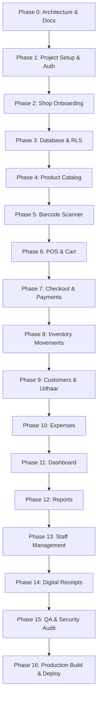

# PocketPOS — Development Roadmap & Phased Execution Plan

## 1. Execution Philosophy & Quality Gates

Per the engineering requirements, PocketPOS must **never** be built in a single chaotic step. Implementation will progress strictly through small, isolated, independently testable phases.

### Mandatory Phase Gate Protocol (Definition of Done)
Before any phase is marked complete and work begins on the subsequent phase, the following six criteria must be verified:
1. **Compilation & Build**: `npm run build` / `npx tsc --noEmit` completes with **0 errors**.
2. **Runtime Verification**: The application loads cleanly in the simulator/device with zero red screens or uncaught console warnings.
3. **Behavioral Testing**: Every feature listed in the phase is tested with realistic inputs, edge cases, and network variations.
4. **No Fake Functionality**: Any button or control displayed must have full backend wiring or an explicit "Coming Soon" badge.
5. **Security & RLS Validation**: Verify that multi-tenant boundaries cannot be bypassed.
6. **Documentation & Changelog**: Record phase accomplishments and verification steps.

---

## 2. Phase-by-Phase Roadmap

---

### Detailed Phase Breakdown

#### Phase 0: Architecture & Documentation *(Current)*
- [x] Create Product Requirements Document (`/docs/product-requirements.md`)
- [x] Create System Architecture Document (`/docs/system-architecture.md`)
- [x] Create Database Design & Schema Specification (`/docs/database-design.md`)
- [x] Create Security & RLS Matrix (`/docs/security.md`)
- [x] Create UI Screen Map & Flow Specification (`/docs/ui-screen-map.md`)
- [x] Architecture approved by user.

#### Phase 1: Project Setup + Authentication *(Completed)*
- [x] Initialize Expo application with TypeScript and Expo Router.
- [x] Configure icons (`lucide-react-native`) and design system theme tokens.
- [x] Integrate `@supabase/supabase-js` with `expo-secure-store` session adapter.
- [x] Implement Sign Up, Login, Logout, and Forgot Password screens.
- [x] Build persistent session restore, token refresh, and AuthContext with `useAuth` hook.
- [x] Implement Zod form schemas and user-friendly error mappings.
- [x] Implement protected route redirection guards (`RootNavigation`).
- [x] **Phase Gate**: 0 TypeScript errors, 0 lint problems, Android bundle export verified, unit tests passing.

#### Phase 2: Shop Onboarding *(Completed)*
- [x] Build onboarding wizard for newly registered users (`apps/mobile/app/(onboarding)/create-shop.tsx`).
- [x] Capture Shop Name, Phone, Address, City, Currency (PKR), Tax %, Invoice Prefix, and optional Logo.
- [x] Atomic stored procedure `create_shop_with_owner` locking `owner_id` to `auth.uid()` and creating `OWNER` membership.
- [x] Implement navigation guard: redirect users without a shop to Onboarding, and users with a shop to `/(tabs)`.
- [x] Expo ImagePicker integration with Supabase Storage bucket upload service.
- [x] Zod validation for Pakistani phone formats, tax percentage, and safe invoice prefixes.
- [x] **Phase Gate**: 0 TypeScript errors, 0 lint problems, Android bundle export verified, automated unit tests passing.

#### Phase 3: Database Foundation + RLS Enforcement + Atomic Checkout *(Completed)*
- [x] Complete production PostgreSQL schema migration (`supabase/migrations/20260927000002_phase3_database_foundation.sql`).
- [x] Defined all 10 core tables: `categories`, `products`, `customers`, `sales`, `sale_items`, `payments`, `customer_payments`, `inventory_movements`, `expenses`, `shop_invoice_sequences`.
- [x] Partial unique indexes for nullable barcodes/SKUs (`(shop_id, barcode)`, `(shop_id, sku)`) and phones (`(shop_id, phone)`).
- [x] Strict Row Level Security policies on all 10 tables enforcing shop tenant isolation.
- [x] Concurrency-safe sequential invoice number generator `generate_invoice_number(p_shop_id)`.
- [x] High-performance atomic checkout stored procedure `complete_sale_transaction` with `SELECT ... FOR UPDATE` row locks.
- [x] Atomic Udhaar debt settlement stored procedure `record_customer_payment`.
- [x] Authoritative server-side pricing, stock exhaustion protection, and zero client trust.
- [x] Full TypeScript definitions and sales API service layer (`src/types/database.ts`, `src/services/sales.ts`).
- [x] **Phase Gate**: 0 TypeScript errors, 0 lint warnings, Android bundle export verified, 5 automated test suites passing.

#### Phase 4: Product Management (Completed)
- [x] Build Products list screen with search, categories, and stock count badges.
- [x] Category management (view, add, edit, safe delete, product count aggregation).
- [x] Product creation and editing forms (Name, Barcode, SKU, Buy Price, Sell Price, Stock, Min Stock, Unit).
- [x] Supabase Storage image upload for product photos (`shop-assets` isolated by shop).
- [x] Product activation / deactivation workflow (preserves history, hides inactive items from cashiers).
- [x] Concurrency-safe atomic stock adjustment RPC (`adjust_product_stock`) with full audit movement trail.
- [x] Role-based field masking: Cashiers cannot view purchase cost or manage categories/stock.
- [x] **Phase Gate**: Add, edit, search, filter, and upload images for products. Verify uniqueness constraints on barcode. 0 TypeScript errors, 0 lint warnings, clean Hermes export, 6 automated test suites passing.

#### Phase 5: Mobile Barcode Scanner
- Implement `expo-camera` barcode viewfinder with targeted reticle overlay.
- Configure flashlight/torch toggle and camera switch.
- Add audio "beep" and haptic vibration upon successful decode.
- Implement scan resolver: auto-lookup product by barcode.
- Quick "Product Not Found -> Add New Product" flow with pre-populated barcode.
- One-handed ergonomics optimization.
- **Phase Gate**: Test barcode scan on real barcodes. Verify fast scan resolution (<200ms) and modal handling.

#### Phase 6: POS / Cart
- Main POS sales terminal screen.
- Active cart state store (`useCartStore` with Zustand).
- Item list in cart with quantity adjustments (`+`, `-`, keypad).
- Line-item discount and cart-level discount.
- Subtotal, tax calculation, and grand total.
- Fast swipe-to-delete item from cart.
- **Phase Gate**: Test cart calculations with discounts and taxes. Verify reactive updates with 0 lag.

#### Phase 7: Checkout & Payments
- Quick checkout sheet.
- Fast cash tender buttons (Rs. 100, 500, 1000, 5000) with automatic change calculation.
- Payment method selector: Cash, Bank Transfer, Easypaisa, JazzCash, Udhaar (Credit).
- Integration with atomic PostgreSQL RPC `complete_sale_transaction`.
- Handle partial payments and credit balance allocation.
- **Phase Gate**: Complete sale in all payment modes. Verify database atomic commit and rollback on error.

#### Phase 8: Inventory & Movements
- Automated stock decrement upon sale completion.
- Inventory movement audit table logging (`SALE`, `PURCHASE_RECEIPT`, `MANUAL_CORRECTION`, `DAMAGED_EXPIRED`).
- Manual stock adjustment UI with mandatory reason entry.
- Visual low-stock alert badges (`current_stock <= min_stock`).
- Strict non-negative inventory enforcement.
- **Phase Gate**: Run sale, check stock reduction in products table and corresponding row in `inventory_movements`.

#### Phase 9: Customers & Udhaar (Credit) Management
- Customer directory with search and phone numbers.
- Customer detail view showing total purchases and outstanding balance.
- Khata ledger view (debit for sales, credit for repayments).
- Record debt repayment modal with payment methods.
- Assign customer to POS cart with automatic Udhaar ceiling checks.
- **Phase Gate**: Create sale with Udhaar, verify customer balance increases. Record repayment, verify balance decreases.

#### Phase 10: Expense Management
- Daily expenses list with category filters (Rent, Utilities, Salaries, Tea, etc.).
- Add expense modal with date, amount, category, and notes.
- Aggregate daily and monthly expense totals.
- **Phase Gate**: Add and delete expenses. Verify owner-only permissions.

#### Phase 11: Mobile Dashboard
- Clean, executive home screen for store owners.
- Key Metric Cards: Today's Sales, Today's Orders, Items Sold, Low Stock Alerts, Outstanding Udhaar, Today's Expenses, Estimated Gross Profit.
- Simple 7-day sales trend visualization.
- Quick Action buttons: "New Sale", "Add Product", "Record Expense".
- **Phase Gate**: Verify metric calculations match actual database aggregates. Test zero-data / empty states.

#### Phase 12: Reports & Analytics
- Sales report by date filter (Today, Yesterday, Last 7 Days, This Month, Custom).
- Top 10 selling products report.
- Low stock reorder report.
- Udhaar ageing report.
- **Phase Gate**: Filter reports across dates and verify accuracy against raw transaction records.

#### Phase 13: Staff Management
- Staff member list with roles (`OWNER`, `CASHIER`).
- Invite/Add cashier flow.
- Activate/deactivate cashier accounts.
- Per-cashier shift sales performance view.
- Cashier view restrictions (hide cost prices, hide profit, hide expenses).
- **Phase Gate**: Log in as Cashier, verify restricted access to reports and settings.

#### Phase 14: Digital Receipts & Sharing
- High-fidelity digital invoice view with shop logo, item breakdown, and tax.
- One-tap WhatsApp sharing (`whatsapp://send?text=...`) with pre-formatted invoice summary.
- Share via system sheet (SMS, Email, AirDrop).
- Print/Save as PDF preview.
- **Phase Gate**: Test WhatsApp sharing intent and verify formatted message contents.

#### Phase 15: QA, Edge Cases & Security Audit
- Exhaustive TypeScript type check across the entire workspace.
- Multi-tenancy leak testing (attempt cross-tenant ID injection).
- Offline mode and reconnection test.
- Input fuzzing (negative numbers, extreme quantities, special characters).
- Performance profiling on low-end device.
- **Phase Gate**: Zero critical security vulnerabilities, zero unhandled exceptions.

#### Phase 16: Production Build & Deployment
- Production app bundling with Expo EAS (`eas build --platform android/ios`).
- Deploy Next.js Web Admin to Vercel.
- Environment variable verification for production Supabase project.
- Production smoke test.
