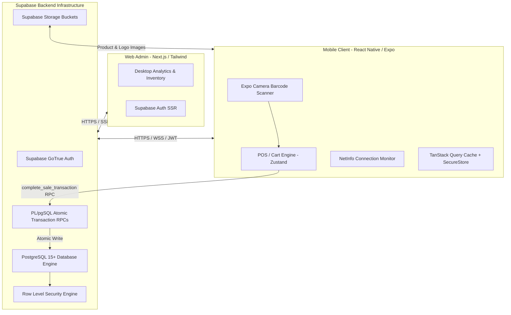
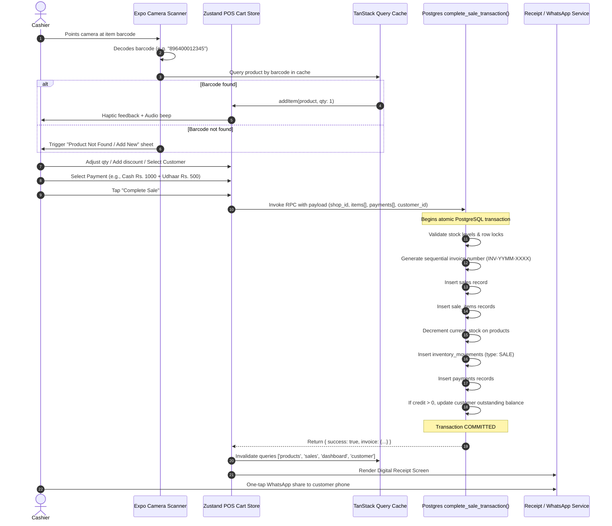

# PocketPOS — System Architecture & Design

## 1. High-Level Architecture Overview

PocketPOS operates on a modern cloud-first, mobile-centric architecture. The client is a performant React Native application built with Expo and TypeScript, backed directly by Supabase (PostgreSQL, Row Level Security, Auth, Storage, and Realtime/Edge RPCs). A companion Web Admin dashboard (Next.js + Tailwind CSS) provides store owners with deeper desktop analytics and bulk management.



---

## 2. Technology Stack Selection & Rationale

| Layer | Technology | Rationale |
| :--- | :--- | :--- |
| **Mobile Runtime** | React Native (Expo SDK 51+) | Cross-platform (iOS/Android) from a single TypeScript codebase. Fast iteration with Expo Go and rock-solid EAS builds. |
| **Mobile Navigation** | Expo Router (File-based) | Type-safe deep linking, streamlined tab and modal hierarchies, native stack transitions. |
| **Camera & Barcode** | `expo-camera` / MLKit barcode scanner | Direct hardware integration with zero native bridge overhead. High frame-rate barcode decoding for EAN, UPC, and Code 128. |
| **Local State (Cart/UI)** | Zustand | Ultra-lightweight (<2KB), zero boilerplate, synchronous state transitions for cart updates, persistable to AsyncStorage. |
| **Server State & Cache**| TanStack Query v5 | Automatic background refetching, query invalidation on mutation, optimistic updates, and offline caching hooks. |
| **Backend & Database** | Supabase (PostgreSQL 15+) | Enterprise-grade SQL engine with native JSONB, ACID transactions, Row Level Security (RLS), and managed Auth. |
| **File Storage** | Supabase Storage (S3-backed) | Built-in CDN, asset bucket access control policies linked to `shop_id`. |
| **Web Admin Console** | Next.js 14+ (App Router) + Tailwind | Fast server-side rendered dashboard for owners who prefer full-screen reports on laptops or tablets. |

---

## 3. Data Flow Architecture: Scan-to-Receipt Lifecycle

The core transaction lifecycle must be completely atomic, durable, and performant.



---

## 4. State Management Boundaries

To prevent messy state overlapping, state is strictly separated into four discrete tiers:

1. **Authentication & Profile State (`useAuthStore`)**:
   - Holds user JWT session, active user profile, assigned role (`OWNER` vs `CASHIER`), and currently active `shop_id`.
   - Token refresh managed via Supabase client with secure storage.
2. **Server Cache State (`TanStack Query`)**:
   - Manages asynchronous server data: product list, categories, sales history, customer directories, analytics metrics.
   - Provides background stale-while-revalidate and cached offline reads.
3. **Active Cart & Checkout State (`useCartStore` - Zustand)**:
   - Ephemeral in-memory cart: items array, active customer, payment distribution, order discounts.
   - Isolated from network latency so scanning and quantity steppers remain instantaneous (60fps).
4. **Local Hardware / UI State**:
   - Camera permissions, torch status, modal visibility, camera scanning pause locks.

---

## 5. Offline-First Resilience Strategy

While PocketPOS is cloud-synchronized, Pakistani retail shops frequently encounter unstable cellular connections (2G/3G/4G dips) or load-shedding internet drops.

### 5.1 MVP Offline Safeguards
- **Realtime Connection Monitoring**: `@react-native-community/netinfo` continuously tracks network availability. An ambient top-bar indicator signals `Online` (green) or `Offline (Working from Cache)` (amber).
- **Cached Product Catalog**: TanStack Query persists the catalog locally in AsyncStorage. When offline, cashiers can still search cached products and verify prices.
- **Fail-Safe Checkout Guard**: If the device is offline during checkout, the app alerts the user: *"You are offline. To prevent duplicate invoices and unsynced stock, reconnect to internet to finalize this sale."* It saves the pending cart draft locally in storage so no scanned cart is ever lost.
- **Post-MVP Synchronization Engine**: The database design uses client-generated UUIDs (`id UUID DEFAULT gen_random_uuid()`), which enables future asynchronous offline queueing without ID collisions.

---

## 6. Monorepo Project Structure

```
pocket-pos/
├── docs/                       # Architecture, PRD, DB, Security docs
├── apps/
│   ├── mobile/                 # React Native / Expo Application
│   │   ├── app/                # Expo Router file-based routes
│   │   │   ├── (auth)/         # Sign up, Login, Forgot password
│   │   │   ├── (onboarding)/   # Shop creation wizard
│   │   │   ├── (tabs)/         # Bottom tab navigation
│   │   │   │   ├── index.tsx   # Dashboard / Home
│   │   │   │   ├── pos.tsx     # Main POS sales terminal
│   │   │   │   ├── products/   # Products catalog & management
│   │   │   │   ├── customers/  # Customers & Udhaar ledger
│   │   │   │   └── more/       # Secondary modules
│   │   │   ├── modals/         # Scanner, Add Customer, Receipt modal
│   │   │   └── _layout.tsx
│   │   ├── src/
│   │   │   ├── components/     # UI components (Button, Input, Card, Modal)
│   │   │   ├── features/       # Feature-specific modules (pos, inventory, etc.)
│   │   │   ├── hooks/          # Custom reusable React hooks
│   │   │   ├── services/       # Supabase client, API wrappers, RPC calls
│   │   │   ├── stores/         # Zustand stores (cart, auth, ui)
│   │   │   ├── types/          # Database & domain TypeScript definitions
│   │   │   ├── utils/          # Currency formatters, date helpers, validators
│   │   │   └── constants/      # Colors, typography, spacing, themes
│   │   ├── package.json
│   │   ├── tsconfig.json
│   │   └── app.json            # Expo config
│   │
│   └── web/                    # Next.js Web Admin Console (Owner Portal)
│       ├── app/                # Next.js 14 App Router
│       ├── components/         # Tailwind desktop UI components
│       ├── lib/                # Supabase SSR client
│       └── package.json
│
├── supabase/                   # Supabase Infrastructure as Code
│   ├── migrations/             # SQL schema migrations & RLS policies
│   ├── functions/              # Edge functions
│   ├── seed.sql                # Dev test seed data
│   └── config.toml
│
├── packages/                   # Shared TypeScript packages
│   └── types/                  # Shared database & entity interfaces
│
└── package.json                # Root npm/pnpm workspace config
```
