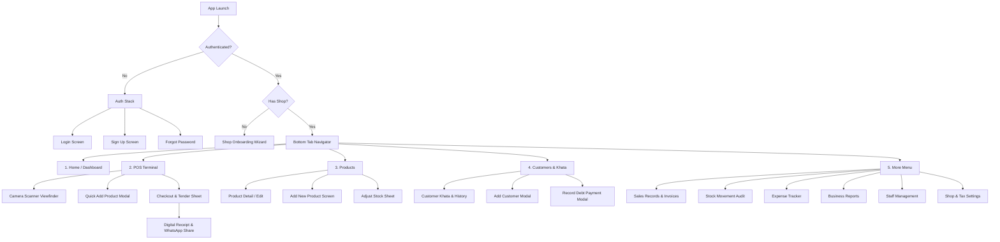

# PocketPOS — Mobile UI Screen Map & Navigation Hierarchy

## 1. Information Architecture & Navigation Flow

PocketPOS uses a bottom-tab navigation paradigm combined with targeted modal sheets for high-speed workflows (such as barcode scanning, cart adjustment, and checkout).



---

## 2. Screen Specifications & Layout Hierarchy

### 2.1 Tab 1: Home / Dashboard (`/tabs/index.tsx`)
- **Header**: Shop Name, Shop Avatar, Network Status Badge (`Online`/`Offline`), Notification bell.
- **Body**:
  - **Quick Metric Grid**:
    - Today's Sales (`Rs. 48,250`)
    - Today's Orders (`52 orders`)
    - Items Sold (`184 items`)
    - Low Stock Items (`4 items ⚠️`)
    - Outstanding Udhaar (`Rs. 28,400`)
    - Today's Expenses (`Rs. 1,200`)
    - Estimated Gross Profit (`Rs. 11,350`)
  - **7-Day Sales Trend Bar Chart**: Lightweight SVG bar chart showing daily revenue.
  - **Urgent Alerts Section**: Tap to view low-stock items or customers with high overdue credit.
- **Thumb Zone Bottom Actions**:
  - Floating Quick Action: **"⚡ Start Sale"** (jumps directly to POS tab).

### 2.2 Tab 2: POS Terminal (`/tabs/pos.tsx`)
- **Design Priority**: Optimized for rapid one-handed retail operation.
- **Top Bar**: Search input with clear button, Scanner launch icon button, Customer selector pill (defaults to `"Walk-in Customer"`).
- **Upper Sub-Bar**: Category filter horizontal pill carousel (`All`, `Beverages`, `Snacks`, `Dairy`, `Grains`).
- **Product Quick Grid**: 2-column or list cards with large tap targets. Displays Product Name, Selling Price, and current stock badge. Tapping instantly adds 1 unit to cart.
- **Sticky Bottom Cart Summary Bar**:
  - Displays: Total items count, Grand Total (`Rs. 1,450`).
  - Slide-up gesture or tap opens the **Active Cart Sheet**.
  - Direct Action Button: **"Scan Barcode"** (launches camera reticle).

### 2.3 Modal: Barcode Scanner (`/modals/scanner.tsx`)
- **Full-Screen Viewfinder**: Native camera feed with semi-transparent dimming outside the active scan zone.
- **Controls**:
  - Top: Close button, Flashlight toggle, Camera flip.
  - Center: Glowing targeting frame. Green pulse upon barcode match.
  - Bottom: Recent scanned item card (shows last decoded item name + price + "+1 added") so the user can scan 10 items in rapid succession without leaving the screen.
  - Manual Barcode Entry button at the bottom for unscannable crumpled packaging.

### 2.4 Modal: Checkout & Payment Sheet (`/modals/checkout.tsx`)
- **Header**: Invoice Summary with Item count, Subtotal, Discount, Tax.
- **Customer Assignment**: Shows attached customer or allows quick attachment.
- **Payment Tenders**:
  - Method selector pills: `Cash`, `Bank Transfer`, `Easypaisa`, `JazzCash`, `Udhaar (Credit)`.
  - Fast Cash Preset Buttons: `Exact`, `+ Rs. 500`, `+ Rs. 1000`, `+ Rs. 5000`.
  - Received Amount Input with live dynamic `Change Due` calculation (e.g. `Change to Return: Rs. 150`).
  - If `Udhaar` selected: confirms customer balance and calculates new debt total.
- **Primary CTA**: Full-width **"Complete Sale (Rs. 1,850)"** with haptic feedback.

### 2.5 Screen: Digital Receipt (`/modals/receipt.tsx`)
- **Visual Design**: Clean white paper invoice card on soft slate background.
- **Invoice Content**:
  - Shop Logo + Shop Name + Address + Phone
  - Invoice # (`INV-2609-01042`) + Timestamp
  - Itemized table with quantities, prices, discounts
  - Total Paid, Change Returned, and Remaining Credit
  - Shop footer note
- **Sticky Action Bar**:
  - **WhatsApp Button** (Green): One-tap share to customer's mobile number.
  - **Share / Save PDF Button** (Blue): System share sheet.
  - **New Sale Button** (Dark): Resets cart and returns to POS terminal.

### 2.6 Tab 3: Products Catalog (`/tabs/products.tsx`)
- **Header**: Title, Category Filter, Search Bar, "Add Product" Floating Action Button (`+`).
- **List Item**:
  - Product thumbnail image or colored category placeholder.
  - Name, Barcode, SKU.
  - Selling Price (`Rs. 320`) and Stock pill (Green if ample, Red if `<= min_stock`).
- **Product Actions Sheet (on tap)**:
  - Edit details
  - Adjust stock (Restock / Damage / Audit)
  - Toggle Active/Inactive
  - Delete product (Owner only)

### 2.7 Tab 4: Customers & Khata Ledger (`/tabs/customers.tsx`)
- **Header**: Search by name or phone number, "Add Customer" button.
- **Summary Header**: Total Market Receivables (`Total Udhaar: Rs. 184,200`).
- **Customer Row**:
  - Name and Phone Number.
  - Outstanding Balance (`Rs. 3,500 Due` highlighted in amber/red).
  - Last purchase date.
- **Customer Profile & Statement**:
  - Full transaction ledger showing debit (purchases on credit) and credit (payments received).
  - Prominent CTA: **"Record Payment Received"** to settle debt with partial or full amount.

### 2.8 Tab 5: More Menu (`/tabs/more.tsx`)
Grid of secondary management modules:
1. **Sales History**: Filterable list of all completed invoices with search and detail modals.
2. **Inventory Movements**: Transparent audit trail of all incoming and outgoing stock movements.
3. **Expenses Tracker**: Categorized daily spending logs with monthly totals.
4. **Reports & Analytics**: Best sellers, low stock reports, daily/weekly revenue graphs.
5. **Staff Management**: Add cashiers, view per-cashier sales, deactivate staff.
6. **Shop & Tax Settings**: Update shop address, phone, logo, tax rate %, and invoice prefixes.
7. **Profile & Sign Out**: Account settings and secure logout.

---

## 3. Thumb Zone Ergonomics (One-Handed Mobile POS)

```
+--------------------------+
|  Top Status / Search     |  <-- Hard to reach (Reference info only)
+--------------------------+
|                          |
|  Product Grid / History  |  <-- Moderate reach (Scroll & Browsing)
|                          |
+--------------------------+
|  ACTIVE CART DRAWER      |
|  SCANNER LAUNCH BUTTON   |  <-- NATURAL THUMB ZONE (Primary POS Actions)
|  COMPLETE CHECKOUT CTA   |
+--------------------------+
|  [H]  [POS]  [P]  [C] [M]|  <-- Bottom Tab Navigation
+--------------------------+
```
